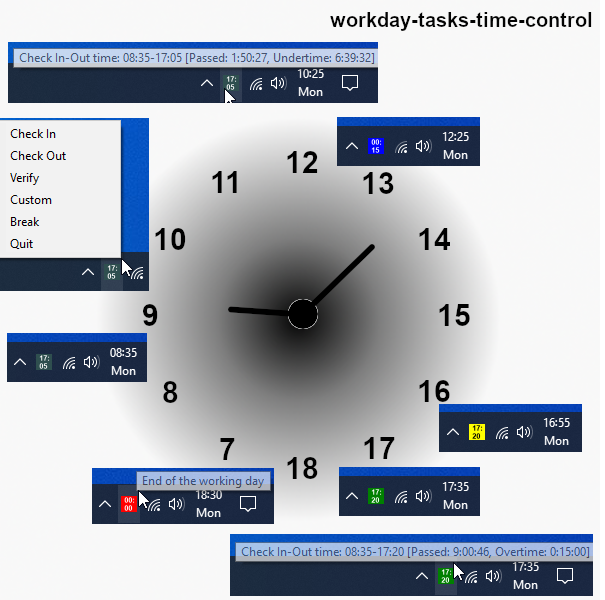
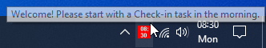

# workday-tasks-time-control

This is a modern, customizable, open-source RPA - Robotic Process Automation - solution with Robocorp environment that will help you to "*turn on/off work*" and to avoid uncontrolled overtime, or in other words will help you to:	

- keep track of the starting, ending and the total work time during each workday;
- automate the checkin-checkout type of actions you need or want to perform daily, to confirm the start and the end of the workday;
- have the current workday status visible, and the actions at hand, as a system tray icon, and be notified when checkout time is approaching or if overtime started.

This is mostly useful when you are usually starting the workday at flexible, irregular hours in the morning, and in turn you need to calculate and remember during the day when you started and when you should end the workday (and close the computer), while you want to make sure you worked the required or expected amount of time. Or you are doing overtime regularly while you are in the home office, just in case. Or when you are using a checkin-checkout type of internal system for recording the start and the end of the working day, which you want to automate.

  

## Solution concepts

This is a highly customizable and transparent open-source RPA - Robotic Process Automation - solution with Robocorp, Robot Framework and Selenium or Playwright libraries and extended with Python. It was implemented by using three main concepts: **levels concept**, **check in - check out concept** and **detached concept**. Works on Windows and macOS.

**1. Levels concept**

The solution has currently three levels, where each level is built on and adds more complexity to the previous one. The three levels are **time control level**, **web application level** and **actions level**. The time control level is enabled by default, the others are disabled and needs to be enabled if you want to use them. Detailed levels concept explanation can be found in the related [document](./docs/levels.md).

**2. Check In - Check Out concept**

The "*Check In*" and "*Check Out*" type of actions will act differently, depending on the level you had enabled and want to use:
- time control level will record in a vault file the start and the calculated end time of the workday, and will display the workday status as a tray icon.
- web application level will automatically open one or two URLs when you start and end the workday, e.g. to record the checkin time or for other purpose.
- action level will automate the actions on the web pages opened on the previous level

**3. Detached concept - vault.json file**

There is only one file, **vault.json** (or [custom name](./docs/howto.md#customizable-vault-file-and-language)), that you need to control to enable or disable the above levels and actions, and for any customizations. Detached concept run means that the solution is totally independent of any continuously running process, and the tray icon is just a handy tool that displays the info found in *vault.json* file. Running the tasks will read the input from _vault.json_ file and write the new status back in the same file and end the process.

**What is Robot Framework and Robocorp?**

Shortly, Robot Framework is a high-level scripting language written in Python, extendable with any standard or custom Python libraries and modules. Compared with other programming languages it has a tabular syntax that is easy to read in native language, and it is accessible to anyone with basic scripting knowledge. Robocorp makes the work with Robot Framework even easier, by managing and automating the whole environment with RCC toolchain.

The Robocorp environment is totally isolated in an user folder (_user\AppData\Local\robocorp_ on Windows or _user\\.robocorp_ on macOS) and it does not mix with the existing user environment. This means downloading this project solution, then downloading the environment, exploring, and then executing the given tasks is harmless.

## QuickStart 

:arrow_double_down: Download this solution
> Download the latest version from under the _Releases_ section and then extract it to any local folder.

:hammer: Install Robocorp Rcc toolchain
> Execute _**tools/install rcc.bat**_ on Windows or see [how to install rcc toolchain](#how-to-install-rcc-toolchain) section below for details, including macOS.

:o2: Run the tasks
> Execute _**run-tasks.bat**_ on Windows or _**run-tasks.command**_ on macOS (after _chmod +x file_) and then choose "*Icon*" task. See [detailed instructions](#the-tasks-and-how-to-run-them) below about the tasks and the alternative ways to run them.

**NOTE: First run:** The full environment is not loaded during RCC toolchain setup, since the needed packages are not known by then, but for any project this is done during first task run. For this solution, it is recommended that you choose "*Icon*" task for first run, and then wait until the full environment is downloaded and ready. See these [notes for robocorp and rcc toolchain](#notes-for-robocorp-and-rcc-toolchain) below for details about the environment location, size and download time. If everything is working correctly, then a system tray red icon will be displayed with the current time on it.

  

On Windows, you can keep the icon visible in the notification area with *Windows Taskbar settings -> Select which icons appear on the taskbar*. On macOS, the icon is always visible.  

After the first run, feel free to start with any of the tasks, right away for experimentation purposes. Due to detached concept solution, any task run on the first level will just modify _vault.json_ file accordingly. This means e.g. that you can first make a copy of this file, do whatever tasks actions freely and then when you are ready to start with a "*Check In*" task in the morning, just restore the original _valult.json_ file.

## How to install RCC toolchain?

**Windows:**

Go to project directory folder and double click _**tools/install rcc.bat**_. This will download the *Robocorp - Rcc toolchain* automatically and will set the Path environment variable. If everything was installed correctly, the displayed messages should be "rcc instance identity is:" and "anonymous health tracking is: disabled". Alternatively, just follow the instructions from https://github.com/robocorp/rcc to install it.

**macOS:**

- Install *Homebrew* from https://brew.sh if you did not install it already previously. (open *Terminal* app and run *brew* command to check). Note that this will take up to ten minutes, if also *Xcode Command Line Tools* are to be installed.

- Install *Robocorp - Rcc toolchain* with the *Terminal* command:
	> brew install robocorp/tools/rcc

- Run the following commands:
	> rcc configure identity --do-not-track

	> rcc configure identity

If everything was installed correctly, the displayed messages should be "rcc instance identity is:" and "anonymous health tracking is: disabled".

## The tasks and how to run them

There are five tasks that you can run, and three ways you can run the tasks. 

**The five tasks** as defined within *robot.yaml* file are: 
- **In** - for "*Workday Check In*"
- **Out** - for "*Workday Check Out*"
- **Verify** - for "*Workday Verify*"
- **Custom** - for "*Custom Task*"
- **Icon** - for displaying the tray icon

**The three ways** to run the tasks are:

1. From within project directory folder, with double click on _**run-tasks.bat**_ on Windows or _**run-tasks.command**_ on macOS, then choose task name to run. Note that the **.command** file on macOS need to set **_chmod +x file_** before executing, due to macOS permisssion restrictions.

2. From **Command prompt** on Windows or **Terminal** on macOS, by executing the following command in the project directory folder, where you will replace the Task word with the actual task name as defined above

> **_rcc run -t Task -e devdata/env.json_** (e.g., rcc run -t Icon -e devdata/env.json)

3. From the "**Icon menu**", after executing any of the *In*, *Out* or *Icon* task since any of these tasks will also display the tray icon.

**Detailed tasks explanation:**

- "*Check In*": to start the workday, calculate, save, and display the end of the workday as an icon text and tooltip. In addition, for second level will open the checkin URL and the custom URL. For third level will do the checkin action on the web page if implemented.
- "*Check Out*": to end the workday, reset the check in data and the text icon, and display the total worked time statistics. In addition, for second level will open the checkin URL. For third level will do the checkout action on the web page if implemented.
- "*Verify*": any time during the day, to verify worked, remaining and under or overtimes. In addition, for second level to verify the checkin URL also.
- "*Custom*": for any level, will open the custom URL if defined. For third level will do the custom actions if implemented.
- "*Icon*":  to display the tray icon, which is the essence of the time control on the first level. The icon is also displayed during "*Check In*" and "*Check Out*" tasks executions and it can be restarted automatically after operating system reboot.

- "*Break*" icon menu is not a task, but it will simply pause the work and will extend the workday by extending the calculated checkout time. To make things easier, you can include the regular lunch break in the standard working time (e.g., use 8h30’ instead of 8h for the STANDARD_WORKING_TIME entry) and then use this menu break for any additional breaks that should normally extend the workday.

As explained above in the **2. Check In - Check Out concept**, the task actions will act differently when web application level and actions level are enabled.

## Notes for Robocorp and Rcc toolchain

- Environment is downloaded under an user folder (_user\AppData\Local\robocorp_ on Windows or _user\\.robocorp_ on macOS). You can remove this folder to cleanup everything and start again from scratch.
- First task run or when the environment needs updating might take up to 5 minutes to run, and the environment size will be around 1.0 GB. If you switch the library to Playwright, first task run might take up to 15 minutes and the size will be around 3.0 GB.
- The environment upgrade happens when you edit the version packages in the _conda.yaml_ files, if for some reason you would need newer packages.
- You can also clean the environment with the command > _rcc configuration cleanup --help_ (e.g. --all, --dryrun, etc.). See Rcc manual for details:

	https://robocorp.com/docs/rcc/overview

- Other useful libraries are available for RPA tasks, e.g., AWS, Database, Desktop, Email, Excel, and you can use these to record the working times on second and third level by other means than a web application or URL.

	https://robocorp.com/docs/libraries/rpa-framework

- You can find useful projects examples at: https://github.com/robocorp

## Other documentation

**Solution levels**

- [Time control level](./docs/levels.md#time-control-level)
- [Web application level](./docs/levels.md#web-application-level)
- [Actions level](./docs/levels.md#actions-level)

**How to and other useful info**

- [How to enable automatic icon restart by the operating system?](./docs/howto.md#how-to-enable-automatic-icon-restart-by-the-operating-system)
- [What happens if you don't check out after check in or if you check in twice without check out first?](./docs/howto.md#what-happens-if-you-dont-check-out-after-check-in-or-if-you-check-in-twice-without-check-out-first)
- [What if something is not working correctly?](./docs/howto.md#what-if-something-is-not-working-correctly)
- [Customizable vault file and language](./docs/howto.md#customizable-vault-file-and-language)
- [What is the meaning of different icon colors and how to customize them?](./docs/howto.md#what-is-the-meaning-of-different-icon-colors-and-how-to-customize-them)
- [What is the meaning of different output section data?](./docs/howto.md#what-is-the-meaning-of-different-output-section-data)
- [How to store the credentials in the specific system keyring service](./docs/howto.md#how-to-store-the-credentials-in-the-specific-system-keyring-service)
- [How to translate all or replace text messages with own custom text](./docs/howto.md#how-to-translate-all-or-replace-text-messages-with-own-custom-text)
- [How to switch to Playwright library and back](./docs/howto.md#how-to-switch-to-playwright-library-and-back)
