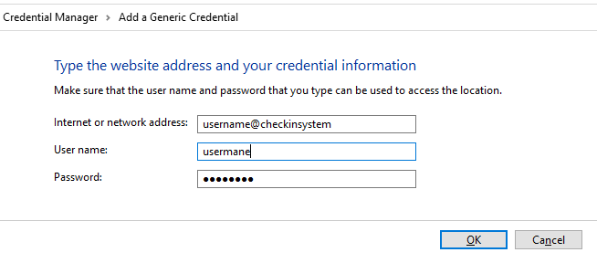

## How to and other useful info

## How to enable automatic icon restart by the operating system?

In order to start the "*Icon*" task with the operating system reboot, go to project directory folder and double click on _**run-tasks.bat**_ on Windows or _**run-tasks.command**_ on macOS, then, instead of a task name write "Startup" (e.g. "Type the task to execute: In, Out... [Icon]: **Startup**"). "Startup" is not a task, but rather an option to create on Windows the "run-tasks.bat Icon" shortcut on startup folder and on macOS to create a _plist_ file under _LaunchAgents_, that will run at startup "run-tasks.command Icon". When this procedure is run again, the files will be deleted, and the "*Icon*" task will not start anymore with the operating system.

## What happens if you don't check out after check in or if you check in twice without check out first?

- "*Check out*" and "*Verify*" tasks will not be executed if "*Check in*" task was not performed first
- If you run the "*Check in*" task and then you forgot to run the "*Check out*" task, then the second "*Check in*" in a row will ignore any cumulated overtime and it will just start a new fresh check in. If needed, this situation can be corrected manually by editing CUMULATED_OVER_UNDER_TIME entry within your _vault.json_ file.
- If you run the "*Check in*" or "*Check out*" task during an active *Break*, then the break time will be ignored and reset.

## What if something is not working correctly?

Most probably your _vault.json_ is corrupted or contains wrong data after wrong manual editing. Just Quit the Icon from the menu, restore your vault content from the original unaltered one and then restart the "*Icon*" task.

## What is the meaning of different icon colors and how to customize them?

The icon will be red on first run, which means workday did not started yet. You can edit your _vault.json_ file and play with own data within MY_DATA and ICON_DATA sections and then do random "*Check in*", "*Check out*" and "*Verify*" tasks. Feel free to experiment with any data to see how it works and how different colors looks like with your operating system color profiles, and when you are ready to start using it, restore your _vault.json_ with the original data. Especially the CUMULATED_OVER_UNDER_TIME is modified during these experiments and can be set to empty string ("") any time manually. Changing the data or any of the colors and saving the file while the icon is visible, will update the icon data and the colors in real time.
	
*NOTE*: You can use any HTML Color name, e.g., https://www.w3schools.com/colors/colors_names.asp, including color "*None*" which means transparent or the color of the system taskbar.

*NOTE*: You can also give the font color in the following way: icon_color=font_color, e.g., _Yellow=Black_, will use black font on the yellow icon so that the text is visible. If there is no font color given, this means by default system color font, usually White. 

	"CHECKIN_DONE_COLOR": The icon color to show during the workday. Default is DarkSlateGrey.
	"CHECKOUT_DONE_COLOR": The icon color when workday has ended and check out was performed, 
	or if workday did not start. Default is Red.
	"OVERTIME_STARTED_COLOR": The icon color when workday standard working time passed. Default is 
	Green (you can perform check out).
	"BREAK_TIME_COLOR": The break started. Default is Blue.
	"CHECKOUT_WARNING_COLOR": The icon color when there are 'warning minutes' left from standard working time.
	Default is Yellow with Black text.
	"CHECKOUT_WARNING_MINUTES": The number of minutes left for warning icon color. Default is 30.

  
  
  
  
  

## What is the meaning of different output section data?

Usually there is no need to edit the entries from the OUTPUT section unless you want to play freely with the calculated data.

	"CUMULATED_OVER_UNDER_TIME": Cumulated over or under time, by counting daily working time differences 
	compared with the standard working time
	"CHECKIN_DATE": Record when you started the workday for the current day
	"CHECKOUT_CALC_DATE": Calculated check out date and time
	"BREAK_TIME_TODAY": Record when you started the current break. When you end the break from the icon menu, 
	the calculated checkout will be modified with the counted break time.
	"TRAY_ICON_PID": Saved PID so that to avoid duplicating the tray icon

## How to store the credentials in the specific system keyring service

Since it is usually not a good idea to store passwords as plaintext in your _vault.json_ file, a better approach is to save them in the following system keyring service, depending of the operating system:

**Credential Manager in Windows:**

Open Credential Manager, then Windows Credential, then click "*Add a generic credential*" and fill in the following:

1. For password

	- "*Internet or network address*": your_username@checkin (your_username is the same as CHECKIN.USER entry from your _vault.json_, and checkin is the same as CHECKIN.SYSTEM entry). E.g., myuser@mycheckinsystem
	- "*Username*": your_username. E.g., myuser
	- "*Password*": your_password (the same as CHECKIN.PASSWORD entry)
 
2. With a special "trick", your_username can be saved under the same system, instead of keeping it inside your _vault.json_, and this is done by using a special entry "username" while the password is your actual username. Click to add a new generic credential and fill in:

	- "*Internet or network address*": username@checkin (the string "username" is not your username, and you should keep it as it is). E.g., username@mycheckinsystem
	- "*Username*": username (unchanged "username" string)
	- "*Password*": your_username (the same as CHECKIN.USER entry). E.g., myuser

  
  

**Keychain for macOS:**

Open Keychain Access, then under Default Keychains click "*login*" and then click Passwords. Click "*Create a new Keychain item*" icon and fill in the following:

1. For password

	- "*Keychain Item Name*": Checkin (the same as CHECKIN.SYSTEM entry from your _vault.json_ file). E.g., mycheckinsystem
	- "*Account Name*": your_username (the same as CHECKIN.USER entry). E.g., myuser
	- "*Password*": your_password (the same as CHECKIN.PASSWORD entry)

2. You can use the same "trick" as for Windows to save your_username. Click to create a new keychain item and fill in:

	- "*Keychain Item Name*": Checkin (the same as CHECKIN.SYSTEM entry). E.g., mycheckinsystem
	- "*Username*": username (the string "username", not your username)
	- "*Password*": your_username (the same as CHECKIN.USER entry). E.g., myuser

  
  

On the first task run that requires credential, there will be a dialog "python wants to use your confidential information stored in "Checkin" in your keychain". Type your keychain password (usually the same as macOS login password) and then Always Allow so that you will not be asked every time you run a task. If you saved both username and password in Keychain, then there will be two dialogs displayed.

**NOTE**: When you want to use system keyring service instead of using your _vault.json_, put the corresponding entry as empty string in the _vault.json_ file.

## How to translate all or replace text messages with own custom text

The language in use is defined by the "LOCALE" entry from _devdata/env.file_: "en" for English and "de" for German.

The localized texts are stored under _locales\en\LC_MESSAGES\template.po_ for English and _locales\de\LC_MESSAGES\template.po_ for German. For English, you can edit this file and add own text to any of the **msgstr** strings, but not necessarily for all, in any language you wish. Do not touch any of the **msgid** strings! For example:
	
	msgid "Check In-Out time"
	msgstr "My start-end working time" or even "Il mio orario di lavoro"

After editing, the _template.mo_ files need to be regenerated from **Command prompt** on Windows or **Terminal** on macOS, by executing the following commands:

- Go to project directory folder and double click on _**run-tasks.bat**_ on Windows or _**run-tasks.command**_ on macOS, then, instead of a task name write "Language" (e.g. "Type the task to execute: In, Out... [Icon]: **Language**").

- The same can be done manually with the following sequence (just for understanding how above Language task works):
> _rcc task script -- python -c "import sys; print(sys.executable)"_
- The above command will list the python executable path, e.g., _mypath\holotree\randomstring\python.exe_
- Notice the above python path, and run the following command that will regenerate the language file:
> _rcc task script -- python mypath\holotree\randomstring\Tools\i18n\msgfmt.py locales\en\LC_MESSAGES\template

For German, replace "en" with "de" in the above command. Notice that _mypath\holotree\randomstring_ is the path returned from previous command, without _python.exe_ part.

To take the new translations into use, restart the Icon by Quit menu and executing the "*Icon*" task.

## How to switch to Playwright library

Due to Selenium limitations and exceptions, it runs much slower than Playwright, mainly when automating dynamic unstable type of web pages. If you want to switch to Playwright, do the following:

- edit "APP_KEYWORDS" from *devdata/env.json* to use "*devdata/url-keywords-pw.robot*". Customize the keywords as needed by your web applications.

- edit *conda.yaml* and add *nodejs*, *robotframework-browser* and *rfbrowser init* entries, as in the example file *tools/conda-pw.yaml*

- Quit and execute the "*Icon*" task, so that the environment will be created for the first time. See these [notes for robocorp and rcc toolchain](/README.md#notes-for-robocorp-and-rcc-toolchain) for details about the enviromnent.

- Remove manually the _output_ directory

- Run the tasks as usual

**Note**: Playwright environment is bigger than Selenium since _node.js_ is installed along with Playwright library, Browser equivalent RPA library and all 3 types of browsers (Chromium, Mozilla and WebKit), all under _AppData\Local\robocorp_ on Windows or *.robocorp* on macOS.
