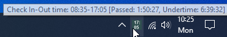
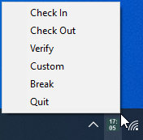
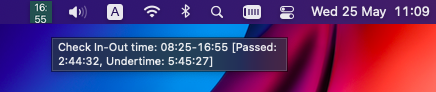
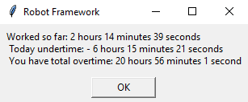

## Solution levels

## Time control level
 
This is the first basic level that is enabled by default and works out of the box. When executing the "*Check In*" task, the current time and the calculated checkout times are recorded in a *vault.json* file. When doing a "*Verify*" task, the under or overtime worked for today, and the total cumulated under or overtime, over multiple days, are displayed. When executing the "*Check Out*" task, the check in time is reset and, cumulated over or undertime is updated.

Of course, having such information in a vault file is not very useful, that's why a tray icon is displayed and it will show all the above information as an easy to read tooltip. The calculated check out time is displayed as a text on the icon, so that you can easily keep track when the workday should end. In addition, you can also easily launch the specified tasks from the icon menu. More details in the following images:

Windows:

  
  

macOS:

  

"*Verify*" task message:

  

## Web application level

The second level will open, during "*Check In*" task, one or two web applications as defined in the vault file, then will fill in the credentials if needed and if you implemented this within the script and then will wait you to do the required actions on the web page. The same procedure will be done at the end of the working day, during "*Check Out*" task.

If you are using an internal system or own system for registering the start and the end of the workday, provided as a web application, then this URL can be set on this level. The custom URL can be a second web application that you can use for other project time recordings, or other such regular additional task that you can do during check in task.

As exemplification, just for demo purpose, on this level the *mail.yahoo* page is opened for the check in URL, and then a weather application for the custom URL. As mentioned these can be replaced with own web applications, and in this case the file _url-keywords.robot_ needs to be modified to do the login for that specific web application. This means on second level already basic scripting knowledge with Robocorp and Selenium or Playwright libraries are needed. And if you just want to play with *mail.yahoo*, then obviously you must provide username and passwords in the _vault.json_ file or by using [system keyring service](./howto.md#how-to-store-the-credentials-in-the-specific-system-keyring-service).

1. To enable this level, edit _vault.json_ variables with own URL data:

Enable "LEVEL_2_ACTIONS":

	"OPEN_CHECKIN_URL": true
	"OPEN_CHECKOUT_URL": true
	"OPEN_CUSTOM_URL": true - only if you want to open also a custom URL after Checkin URL.

Edit "MY_DATA", "CHECKIN" and "CUSTOM" URL Data:

	"CHECKIN.URL": URL of the Checkin web application
	"CHECKIN.SYSTEM": The name of the system is an arbitrary name used to store the credentials in the 
	corresponding system keyring service, depending on the operating system:
	"CHECKIN.PASSWORD": Use temporary for test runs, then it is recommended that you switch to system 
	keyring service so that to avoid plaintext password in this vault file. When the password is empty, 
	the solution will assume the system keyring service will provide the password.
	"CHECKIN.USER": You can keep the username in vault file, but you can also save it in the system keyring 
	service, under the entry named "*username*" if you do not want to have plaintext user in vault file.

	"CUSTOM.URL": URL of the custom web application, if enabled above

See this section for details about [how to store the credentials in the specific system keyring service](./howto.md#how-to-store-the-credentials-in-the-specific-system-keyring-service)

2. If you want to use different URLs than from the demo, then install an editor if not already installed and edit the defined URL_KEYWORDS robot file:

	- Install **Visual Studio Code** with the extensions **Robocorp Code** and **Robot Framework Language Server** (free for personal or commercial use): https://robocorp.com/docs/developer-tools/visual-studio-code/overview

	- Open _url-keywords.robot_ (or custom file if defined), and edit the keyword _Fill Checkin Credentials_ with own HTML selectors as needed by Selenium or Playwright libraries. Selenium is the default.

Note. It is recommended to duplicate the file *url-keywords.robot* with own name, e.g. *url-keywords-my.robot*, open the file _devdata/env.json_ and change URL_KEYWORDS entry with this own file, and thus keep the original file intact.

Depending on if you want to work with Selenium or Playwright libraries and environment, you can switch the environment by following the [how to switch to playwright library and back](./howto.md#how-to-switch-to-playwright-library-and-back) instructions. If you are working with own copy of _url-keywords.robot_ file then the library switch needs to be done before creating this own copy, since the switch is done only on the original files.

3. Execute as usual the tasks from the first level, and then during "*Check In*" and "*Check Out*" tasks, the execution will stop and wait for user actions on the given opened URL pages.

*NOTE*: The second level tasks execution can be also analized by opening _output/log.html_ file and checking the result. If the task works correctly, the result is Pass, otherwise the cause of the error is reported.

## Actions level

The third level might be a little bit more complex, and depending of the specific web application might require more complex modifications on the file *url-keyword.robot* so that to be able to automatize the actual actions that otherwise are expected to be done manually on the second level.

Also, knowledgeable users might choose to extend the solution with the fourth level on top, and with own more complex automated tasks.

1. To enable this level, edit _vault.json_ variables with own data:

Enable "LEVEL_3_ACTIONS":

	"DO_CHECKIN_ACTION": true
	"DO_CHECKOUT_ACTION": true
	"DO_CUSTOM_ACTION": true - only if you want to also open a custom URL after Checkin URL.

2. Open the file _url-keywords.robot_ (or custom file if defined), and edit the keyword _Checkin Url Task_ with own Checkin Action click on the HTML selectors, as needed by Selenium or Playwright libraries. You will need to do the same for Checkout and Custom actions.

3. Execute as usual the tasks from the second level, and then during "*Check In*" and "*Check Out*" tasks, the execution will automatically perform the implemented, customized actions, without any user intervention. If LEVEL_1_ACTIONS.SILENT_RUN is false, then "*Welcome*" and "*Goodbye*" dialogs are displayed at the end of the corresponding task execution.
